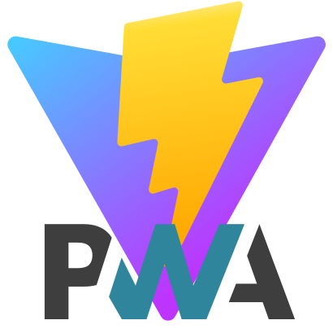

# Golang + React + VitePWA + TypeScript

<div style="display: flex; justify-content: center; align-items: center; gap: 20px;">
  
  
  
  
</div>

## Deskripsi Proyek

Proyek ini adalah aplikasi web modern yang menggabungkan backend yang dibangun dengan Golang dan frontend menggunakan React, VitePWA, dan TypeScript. Tujuan dari proyek ini adalah untuk menciptakan aplikasi web yang cepat, dapat diandalkan, dan responsif dengan memanfaatkan Progressive Web App (PWA) untuk meningkatkan pengalaman pengguna.

## Fitur

### Fitur Utama

- **Backend dengan Golang**: Memanfaatkan kecepatan dan efisiensi Golang untuk API backend menggunakan Go Fiber. Golang memberikan performa yang tinggi dan manajemen concurrent yang baik, sehingga cocok untuk aplikasi skala besar.
- **Frontend dengan React**: Membuat antarmuka pengguna yang dinamis dan responsif. React memungkinkan pengembangan komponen UI yang dapat digunakan kembali dan memudahkan manajemen state aplikasi.
- **VitePWA**: Mengintegrasikan PWA untuk performa yang lebih baik dan kemampuan offline. Vite sebagai bundler modern memberikan kecepatan build dan hot module replacement yang sangat cepat.
- **TypeScript**: Menyediakan pengetikan statis untuk JavaScript yang lebih aman dan lebih dapat diandalkan. TypeScript membantu dalam menulis kode yang lebih robust dan mudah dipelihara.

### Fitur Khusus

- **PWA**: Aplikasi ini mendukung fitur Progressive Web App yang memungkinkan aplikasi bisa diakses secara offline, memberikan pengalaman seperti aplikasi native, dan memiliki kemampuan push notification.
- **CronJob**: Menjalankan tugas terjadwal di backend menggunakan CronJob. Ini berguna untuk tugas-tugas rutin seperti backup database, pembersihan log, atau pengiriman email berkala.
- **JWT**: Mengimplementasikan JSON Web Token (JWT) untuk otentikasi yang aman. JWT memungkinkan stateless authentication yang lebih efisien dan scalable.
- **WhatsApp Websocket (whatsmeow)**: Menggunakan whatsmeow untuk integrasi dengan WhatsApp Websocket, memungkinkan pengiriman dan penerimaan pesan WhatsApp secara langsung melalui aplikasi.
- **Multiple Encryption**: Mendukung berbagai jenis enkripsi untuk data yang disimpan dan dikirimkan. Ini memastikan data pengguna aman dari akses yang tidak sah.
- **End-to-End Encryption**: Menyediakan enkripsi end-to-end untuk komunikasi yang aman antara pengguna. Ini memastikan bahwa hanya pengirim dan penerima yang dapat membaca pesan yang dikirimkan.

## Struktur Direktori

```bash
root
├── cron
│   ├── job
│   │   └── {name}.cronjob.go
│   └── setup.go
├── public
├── server
│   ├── connection
│   │   └── {name}.connection.go
│   ├── env
│   │   └── {name}.env.go
│   ├── http
│   │   ├── module.http.go
│   │   └── server.http.go
│   ├── initialize
│   │   └── {name}.initialize.go
│   ├── middleware
│   │   └── {name}.middleware.go
│   ├── model
│   │   └── {name}.model.go
│   ├── module
│   │   └── {name}.module.go
│   ├── structure
│   │   └── {name}.structure.go
│   ├── util
│   │   └── {name}.util.go
│   ├── variable
│   │   └── {name}.variable.go
│   └── run.go
├── sound
├── src
│   ├── assets
│   ├── components
│   │   ├── Footer.tsx
│   │   ├── Header.tsx
│   │   ├── Container.tsx
│   │   ├── Loading.tsx
│   │   ├── Popup.tsx
│   │   ├── Card.tsx
│   │   ├── Input.tsx
│   │   ├── Button.tsx
│   │   └── ...
│   ├── App.css
│   ├── App.tsx
│   ├── consts.ts
│   ├── env.ts
│   ├── index.css
│   ├── main.tsx
│   ├── PWABadge.css
│   ├── PWABadge.tsx
│   ├── sw.ts
│   ├── vite-env.d.ts
│   └── ...
├── docker-compose.yaml
├── Dockerfile
├── go.mod
├── index.html
├── main.go
├── package.json
├── README.md
├── tsconfig.json
├── vite.config.ts
└── ...
```

## Cara Memulai

### Prasyarat Utama

- [VSCode](https://code.visualstudio.com/)
- [GitBash](https://www.git-scm.com/downloads)
- [Node.js](https://nodejs.org/)
- [Golang](https://golang.org/)

### Prasyarat Khusus

- [MySQL](https://mysql.com/)
- [PostgreSQL](https://postgresql.org/)
- [MongoDB](https://mongodb.com/)
- [RabbitMQ](https://rabbitmq.com/)
- [Redis](https://redis.io/)

### Menjalankan Project

1. Buat folder baru:
    ```bash
    mkdir new-project-name
    cd new-project-name
    ```
2. Clone project kedalam project:
    ```bash
    git clone https://github.com/jefripunza/gorevits .
    ```
3. Masuk ke VSCode:
    ```bash
    code .
    ```
4. Instal dependensi dan kebutuhan:
    ```bash
    bash install.sh
    ```
5. Jalankan project:
    ```bash
    # frontend
    yarn dev:react

    # backend
    yarn dev:go
    ```

## Menulis Kode dengan TypeScript

Berikut adalah contoh komponen React sederhana menggunakan TypeScript:

```typescript
import React from 'react';

interface Props {
  children: React.ReactNode;
  message: string;
}

const HelloWorld: React.FC<Props> = ({ message }) => {
  return <h1>{message}</h1>;
};

export default HelloWorld;
```

## Konfigurasi VitePWA

VitePWA dikonfigurasi di `vite.config.ts`. Berikut adalah contoh konfigurasi dasar:

```typescript
import { VitePWA } from 'vite-plugin-pwa';
import { defineConfig } from 'vite'
import react from '@vitejs/plugin-react'

// https://vitejs.dev/config/
export default defineConfig({
  plugins: [react(), VitePWA({
    strategies: 'injectManifest',
    srcDir: 'src',
    filename: 'sw.ts',
    registerType: 'autoUpdate',
    injectRegister: false,

    pwaAssets: {
      disabled: false,
      config: true,
    },

    manifest: {
      name: 'App Example',
      short_name: 'my-app',
      description: 'Easy use for next Project Application',
      theme_color: '#ffffff',
    },

    injectManifest: {
      globPatterns: ['**/*.{js,css,html,svg,png,ico}'],
    },

    devOptions: {
      enabled: false,
      navigateFallback: 'index.html',
      suppressWarnings: true,
      type: 'module',
    },
  })],
})
```

## Penutup

Proyek ini menyediakan kerangka kerja yang kuat untuk membangun aplikasi web modern dengan menggunakan teknologi terbaru. Dengan mengikuti panduan ini, Anda dapat dengan mudah mengatur dan menjalankan proyek, serta mengembangkannya sesuai kebutuhan Anda.
